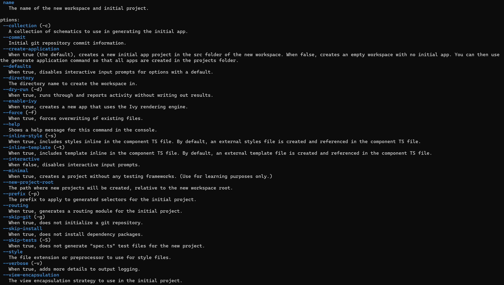
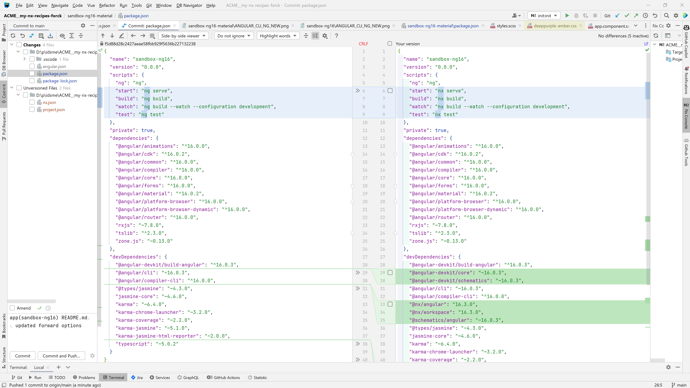

# SandboxNg16

This project was generated with [Angular CLI](https://github.com/angular/angular-cli) version 16.0.3.

## commands used
```
npx -p @angular/cli@8 ng new sandbox --style=scss --routing --prefix app --skip-git
ng add @angular/material [doc](https://material.angular.io/guide/getting-started)
```

```
ng new --help
```


```
npx nx@latest init
```



## TODO But instead of Jest. now Angular Karma is the default.
### add Migrate to Jest instead of Karma? Or Leave it.

## Optional Extra's JSON-Server [doc](https://www.npmjs.com/package/json-server)
```
npm install --save-dev json-server
```

## Optional Extra's Story-Book Manually [doc](https://storybook.js.org/docs/react/get-started/install)
```
npx storybook@latest init
```
 
